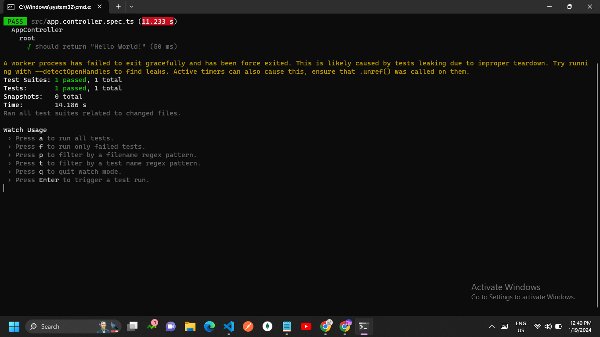

# Test

Detail-oriented and results-driven software developer with a passion for building robust and scalable backend solutions. Experienced in creating RESTful APIs and performing CRUD operations on databases. Adept at utilizing technologies such as NestJS, MySQL, and SQLite. Committed to delivering high-quality code and meeting project deadlines.

### Skills

- **Programming Languages:** TypeScript, JavaScript
- **Backend Frameworks:** NestJS
- **Databases:** MySQL, SQLite
- **Version Control:** Git
- **API Documentation:** Postman

### Project: NestJS CRUD API

**API Documentation:** [https://documenter.getpostman.com/view/26990240/2s9YsT4nyP]

#### Description

Developed a REST API server using NestJS, performing CRUD operations on a MySQL/SQLite database. The API includes validation for name, date of birth, age, and salary fields.

#### Features

- Implemented 4 APIs: Get, Create, Update, and Delete for the "employees" table.
- Added validation for name, date of birth, age, and salary fields.
- Utilized NestJS for building the server.
- Committed code to the GitHub repository.

#### Technologies Used

- NestJS
- TypeScript
- MySQL
- SQLite

#### Database Details

- **MySQL Credentials:**
  - Host: sql12.freesqldatabase.com
  - Database name: sql12678041
  - Database user: sql12678041
  - Database password: 3F1yCIti92
  - Port number: 3306

**PHPMyAdmin Link:** [https://www.phpmyadmin.co/]

### Bonus Points

- Ensured data validation on key fields.
- Maintained a clean and well-documented codebase.
- Committed code, including SQLite, to the public GitHub repository.
- Create Test Cases

## Thanks